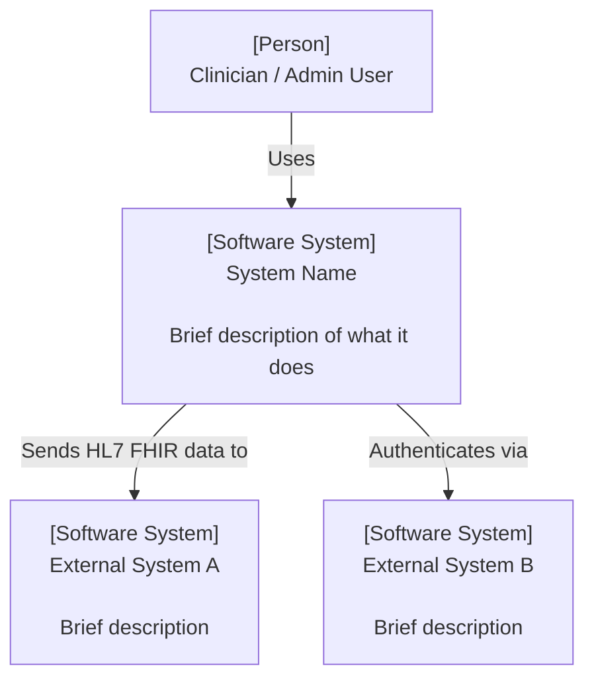
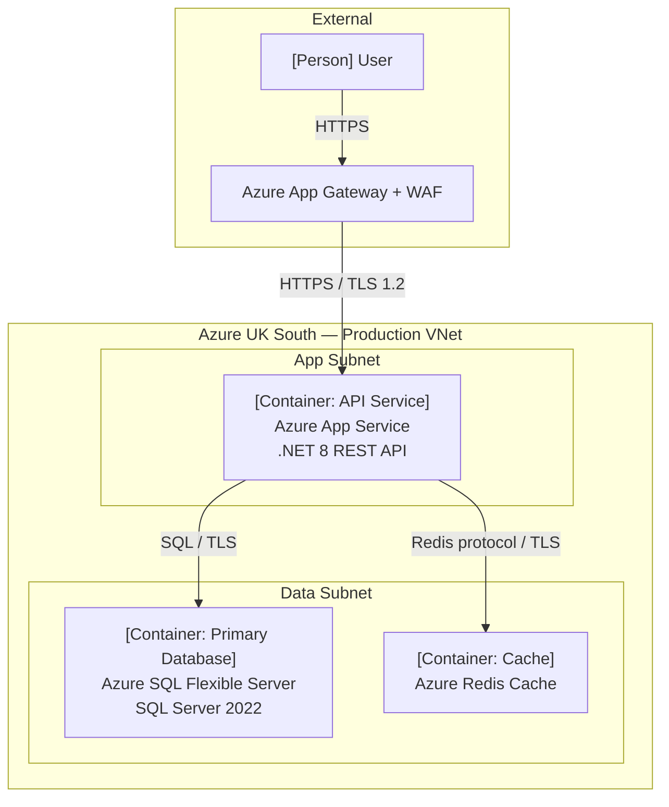
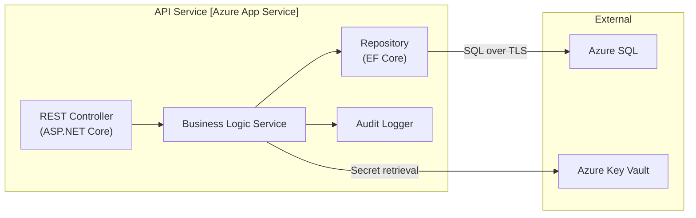

# C4 Model Guide

## Overview

The C4 model (Context, Container, Component, Code) provides a standardised notation for communicating software and infrastructure architecture at four levels of abstraction. Atlas_Architect uses C4 for all architecture documentation alongside Mermaid for diagram rendering.

> **Why C4?** C4 provides a clear hierarchy of diagrams that serve different audiences — from business stakeholders needing context through to engineers needing component detail. It eliminates ambiguity in what a "box" on a diagram represents.

---

## The Four Levels

| Level | Diagram | Audience | Scope |
|-------|---------|----------|-------|
| **1** | System Context | Business stakeholders, product owners | The system and its external dependencies |
| **2** | Container | Architects, senior engineers | Deployable/runnable units (apps, databases, services) |
| **3** | Component | Engineers, PIMS | Internal structure of a container |
| **4** | Code | Developers | Class/function-level detail (rarely used in infrastructure architecture) |

---

## Level 1 — System Context Diagram

**Purpose**: Show the system in question and how it relates to users and external systems. Does not show technology choices. Answers: "What does this do, and who/what does it interact with?"

**Required Elements**:
- The system (central box)
- Human actors (users, operators, business roles)
- External systems (dependencies — APIs, third-party services, partner systems)
- Relationships with brief labels ("sends patient data", "authenticates via", etc.)

**Mermaid Template**:

**EMIS/Optum Conventions**:
- Always include NHS Spine, HSCN, or NHS login where applicable for clinical systems
- Show Entra ID / Azure AD as external system if federated authentication is used
- Show Dynatrace as an external monitoring system
- Show ServiceNow as an external ITSM system

---

## Level 2 — Container Diagram

**Purpose**: Zoom into the system to show the deployable/runnable units and their technology choices. A "container" is any separately deployable unit — a web app, API service, database, message queue, etc. Answers: "What are the major technical components and how do they interact?"

**Required Elements**:
- Each container with technology label (e.g., `[Container: Azure App Service | .NET 8]`)
- Databases and storage (e.g., `[Container: Azure SQL | SQL Server 2022]`)
- Message queues, caches, and supporting services
- Protocols and data formats on all relationships (HTTPS, TLS 1.2, AMQP, HL7 FHIR R4)
- Infrastructure boundaries (VNet, subnet, AZ, region)

**Mermaid Template**:

**EMIS/Optum Conventions**:
- Show network boundaries (VNet / VPC, subnets) as subgraph containers
- Label all connections with protocol and encryption standard
- Show WAF/App Gateway as the ingress boundary — never show internet traffic going directly to an app container
- Show Azure Key Vault / AWS Secrets Manager as a container where secrets are retrieved at runtime

---

## Level 3 — Component Diagram

**Purpose**: Zoom into a single container to show its internal components and responsibilities. Used primarily for complex services or when onboarding PIMS to understand internal structure. Answers: "How is this container internally structured?"

**Required Elements**:
- Internal components (controllers, services, repositories, handlers)
- Data flows between internal components
- External dependencies called by internal components
- Technology annotations where relevant

**Use Sparingly**: Level 3 is only required for:
- Services with 5+ distinct internal components
- PIMS operational handover documentation
- Security review of a high-risk or high-data-classification system

**Mermaid Template**:

---

## Level 4 — Code Diagram

**Level 4 is not used in Atlas_Architect outputs.** Code-level detail is the responsibility of Engineering, not Infrastructure Architecture. Reference application code repositories in Confluence or ADO where required.

---

## Diagram Conventions

### Notation Rules

| Element | Notation | Example |
|---------|----------|---------|
| Person / User | `[Person]\nRole Name` | `[Person]\nClinician` |
| Internal System | `[Software System]\nSystem Name` | `[Software System]\nPatient Portal` |
| External System | `[Software System, External]\nName` | `[Software System, External]\nNHS Spine` |
| Container | `[Container: Type]\nName\nTechnology` | `[Container: API]\nAuth Service\nNode.js` |
| Database | `[Container: Database]\nName\nTechnology` | `[Container: Database]\nPatient DB\nAzure SQL` |

### Relationships

- Always label relationships with the interaction description and protocol
- Use `-->` for synchronous calls
- Use `-.->` for asynchronous / event-driven calls
- Use `<-->` for bidirectional / two-way communication

### Boundary Types

| Boundary | When to Use |
|----------|------------|
| VNet / VPC boundary | Show network isolation per cloud environment |
| Availability Zone | Show when HA / multi-AZ placement is architecturally significant |
| Region | Show for multi-region designs |
| Security Zone | Show for designs with different trust levels (DMZ vs. internal) |

---

## Diagram Checklist

Before publishing a C4 diagram, verify:

- [ ] Level 1 Context diagram produced for all new system designs
- [ ] Level 2 Container diagram produced for all solution designs
- [ ] Level 3 Component diagram produced for complex or security-critical containers
- [ ] All external dependencies shown in Level 1
- [ ] All containers labelled with technology and hosting platform
- [ ] Network boundaries (VNet/VPC, subnets) shown in Level 2
- [ ] All inter-container relationships labelled with protocol and encryption
- [ ] WAF/ingress boundary shown for any internet-facing workload
- [ ] Secrets management (Key Vault / Secrets Manager) shown as a container
- [ ] Monitoring / observability (Dynatrace) shown
- [ ] Diagrams embedded in the corresponding HLD or LLD document

---

## References

- [C4 Model Official Documentation](https://c4model.com/) — Simon Brown's canonical reference
- [Mermaid Flowchart Documentation](https://mermaid.js.org/syntax/flowchart.html) — Mermaid syntax reference
- See [TOGAF Guidelines](./togaf-guidelines.md) for how C4 diagrams map to TOGAF viewpoints
