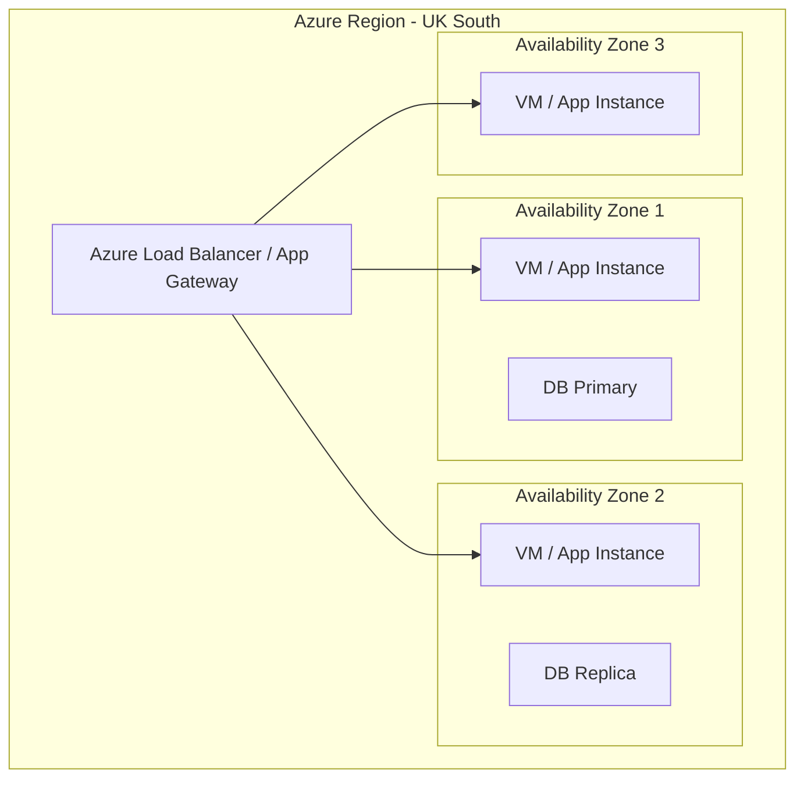
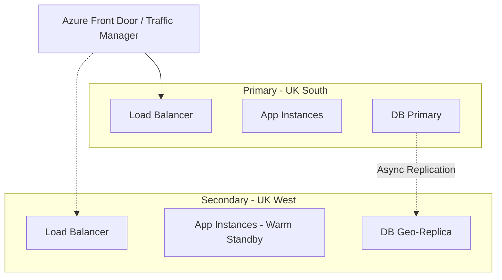
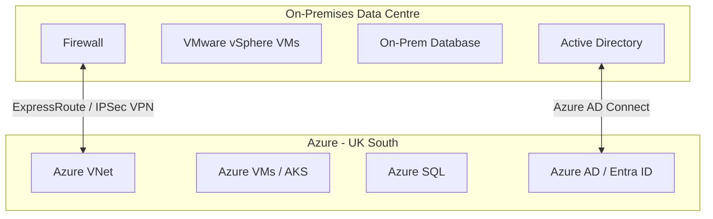
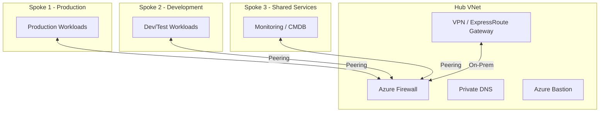

# Infrastructure Design Patterns

## Overview

This reference catalogues common infrastructure design patterns used at EMIS/Optum. Use these patterns as building blocks when designing solutions. Each pattern includes when to use it, the topology, key considerations, and EMIS/Optum-specific guidance.

## Deployment Patterns

### 1. Single-Region, Zone-Redundant (Standard Production)

**When to Use**: Standard production workloads (Tier 2/3) with ≥ 99.9% availability requirement.

**Key Considerations**:
- Minimum 2 instances across availability zones
- Zone-redundant storage (ZRS) for persistent data
- Automated failover between zones
- Cost: ~1.5x single instance

### 2. Multi-Region, Active-Passive (High Availability)

**When to Use**: Tier 1 / mission-critical workloads requiring ≥ 99.99% availability and cross-region DR.

**Key Considerations**:
- Primary region handles all traffic; secondary on warm standby
- Asynchronous database replication (accept RPO > 0)
- Automated DNS failover via Azure Front Door
- Cost: ~2x single region
- Test failover quarterly

### 3. Hybrid Cloud (On-Prem + Azure)

**When to Use**: Workloads requiring on-premises components (legacy systems, data sovereignty, low-latency local access) integrated with Azure services.

**Key Considerations**:
- ExpressRoute preferred for production (dedicated, low latency); VPN as backup
- Azure AD Connect for identity synchronisation
- Split DNS for name resolution across environments
- Consider Azure Arc for unified management of on-prem resources
- Network bandwidth and latency analysis required

### 4. Hub-and-Spoke Network Topology

**When to Use**: Multi-workload Azure environments requiring centralised network services (firewall, DNS, monitoring).

**Key Considerations**:
- Centralised firewall for egress control and logging
- VNet peering between hub and spokes (non-transitive — route through hub)
- Network Security Groups (NSGs) at subnet level in each spoke
- Azure Bastion for secure administrative access (no public RDP/SSH)
- Shared services spoke for Dynatrace, CMDB agents, patching infrastructure

## Application Hosting Patterns

### 5. IaaS — Virtual Machines

**When to Use**: Legacy applications, Windows-based workloads, applications requiring OS-level control, lift-and-shift migrations.

**EMIS/Optum Standards**:
- Azure VM or VMware vSphere (on-prem)
- Standard_D/E/F series for general workloads; M-series for memory-intensive
- Managed disks (Premium SSD for production; Standard SSD for dev/test)
- Availability Sets or Availability Zones (never standalone for production)
- Azure Backup or Veeam for VM-level backup

### 6. PaaS — Managed Services

**When to Use**: New applications, microservices, workloads that benefit from managed infrastructure (less operational overhead).

**EMIS/Optum Standards**:
- Azure App Service / Azure Functions for web workloads
- Azure SQL / Azure Database for PostgreSQL for relational data
- Private endpoints mandatory (no public PaaS endpoints)
- VNet integration for outbound connectivity
- Managed identity for authentication (no connection strings with passwords)

### 7. Containers — Kubernetes

**When to Use**: Microservices architectures, applications requiring rapid scaling, CI/CD-intensive workloads.

**EMIS/Optum Standards**:
- Azure Kubernetes Service (AKS) as primary platform
- Private cluster (no public API server)
- Azure CNI networking with VNet integration
- Azure Container Registry (ACR) for image storage (vulnerability scanning enabled)
- Horizontal Pod Autoscaler + Cluster Autoscaler
- Ingress via Azure Application Gateway or NGINX Ingress Controller
- Dynatrace OneAgent DaemonSet for observability

## Migration Patterns

### 8. Lift-and-Shift (Rehost)

**When to Use**: Rapid migration with minimal application changes; legacy applications where refactoring is not cost-effective.

**Approach**:
1. Assess current on-prem configuration (CPU, RAM, storage, networking)
2. Map to equivalent Azure VM SKUs (use Azure Migrate assessment)
3. Replicate using Azure Migrate or ASR
4. Test in Azure landing zone
5. Cutover with DNS switch

**Considerations**: Quickest migration path but does not leverage cloud-native benefits. Plan for optimisation post-migration.

### 9. Re-Platform (Modernise)

**When to Use**: Applications that can benefit from managed services without full re-architecture (e.g., move SQL Server to Azure SQL).

**Approach**:
1. Identify components that can move to PaaS (database, caching, messaging)
2. Assess compatibility (Azure Database Migration Service assessment)
3. Migrate data tier first, then application tier
4. Update connection strings and networking
5. Validate functionality and performance

### 10. Re-Architect (Refactor)

**When to Use**: Applications being modernised to cloud-native architecture; strategic applications with long-term investment.

**Approach**:
1. Decompose monolith into services (Strangler Fig pattern)
2. Containerise services for AKS deployment
3. Replace stateful components with managed services
4. Implement API gateway and service mesh
5. Staged migration with parallel running

**Considerations**: Highest effort and cost but delivers the most long-term value. Requires close collaboration between architecture and engineering teams.

## Pattern Selection Guide

| Factor | IaaS (VM) | PaaS (Managed) | Containers (K8s) |
|--------|-----------|----------------|-------------------|
| OS-level control needed | ✅ | ❌ | Partial |
| Legacy application | ✅ | ❌ | ❌ |
| Operational overhead | High | Low | Medium |
| Scaling speed | Minutes | Seconds | Seconds |
| Cost efficiency | Medium | High | High (at scale) |
| Migration complexity | Low | Medium | High |
| Team skills required | Traditional ops | Cloud-native | Kubernetes expertise |
| Best for | Lift-and-shift | New development | Microservices |
