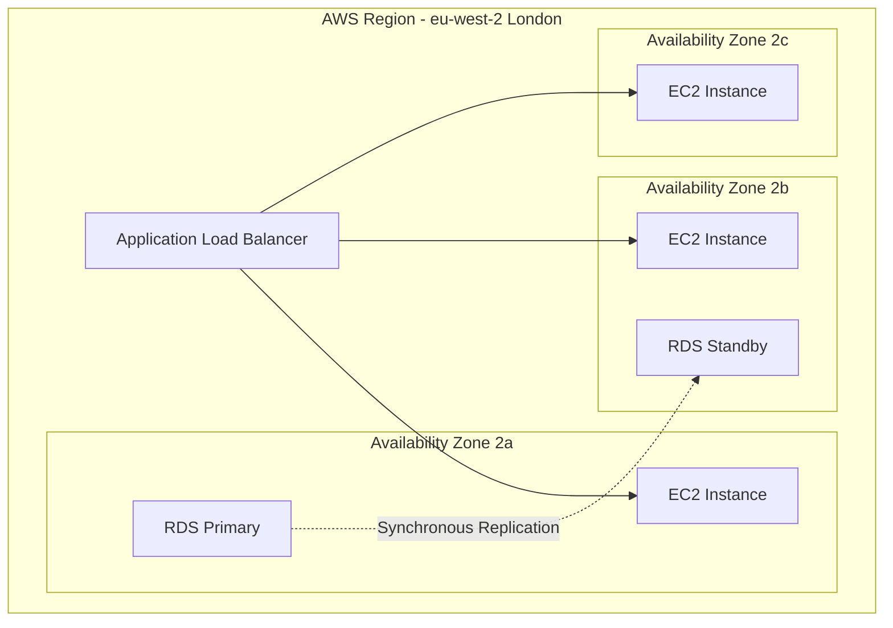
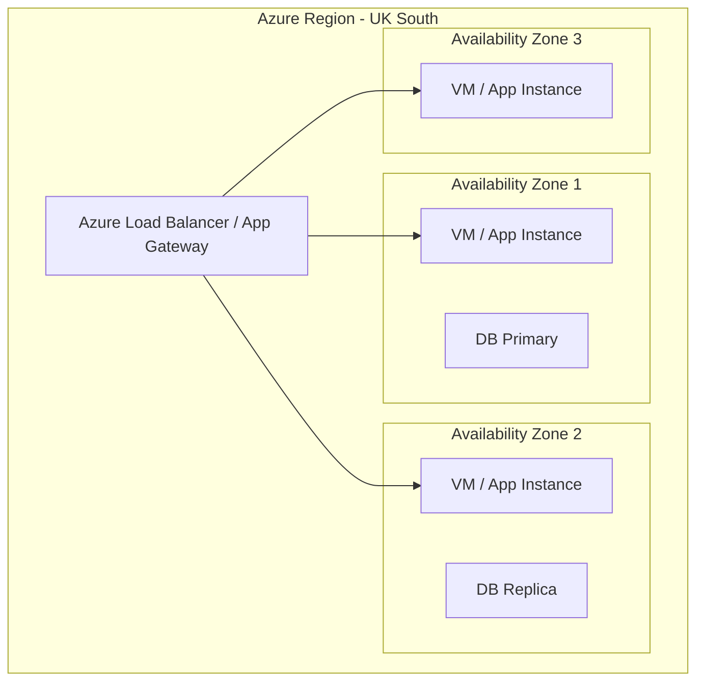
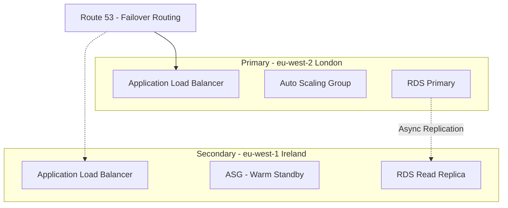
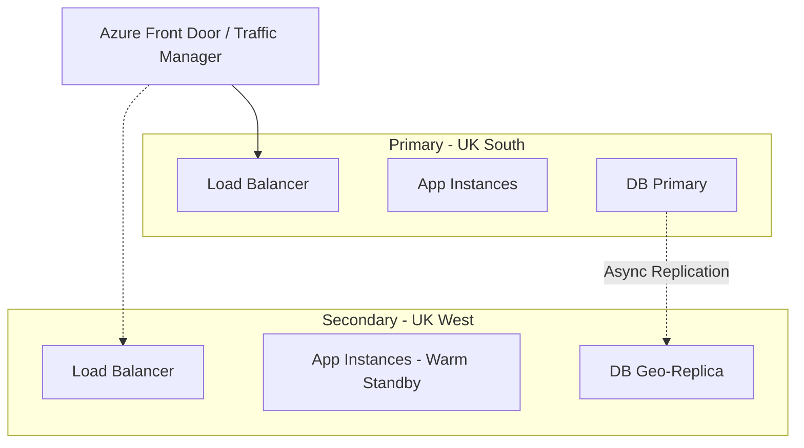
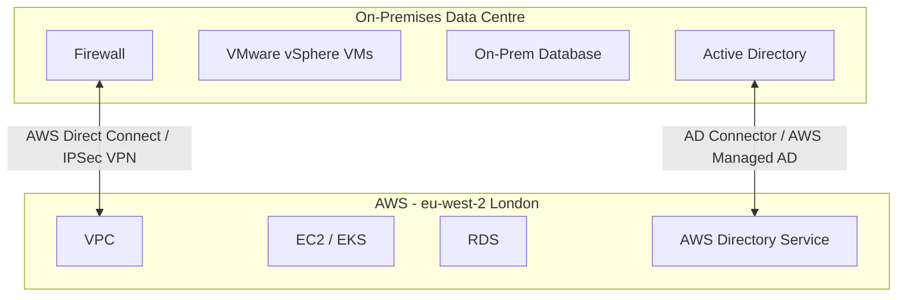
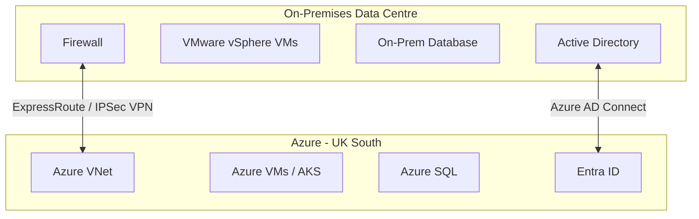
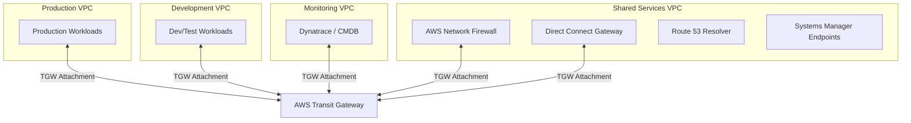
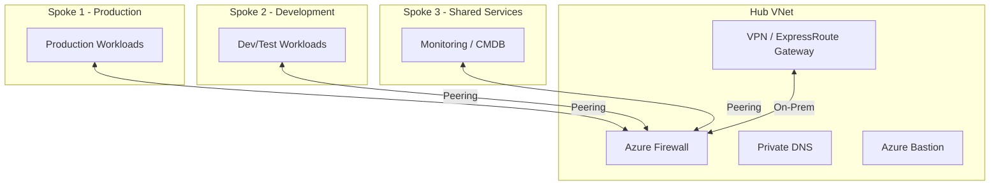
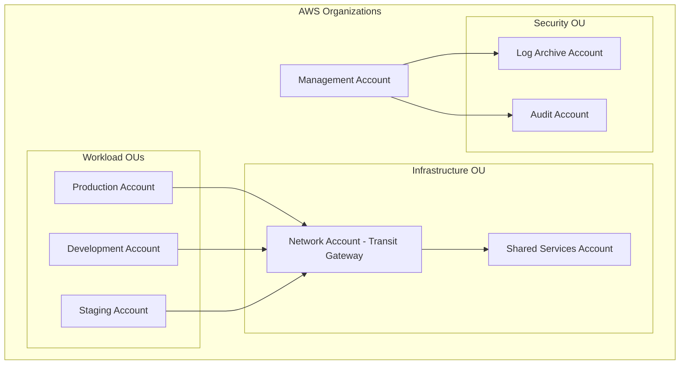

# Infrastructure Design Patterns

## Overview

This reference catalogues common infrastructure design patterns used at EMIS/Optum. Use these patterns as building blocks when designing solutions. Each pattern includes when to use it, the topology, key considerations, and EMIS/Optum-specific guidance.

> **Cloud Strategy**: AWS is the primary cloud platform. Azure is the secondary cloud platform used for specific workloads (e.g., M365-integrated services, legacy Azure-hosted applications). All patterns below provide AWS-primary guidance with Azure equivalents where applicable.

---

## Deployment Patterns

### 1. Single-Region, Multi-AZ (Standard Production)

**When to Use**: Standard production workloads (Tier 2/3) with ≥ 99.9% availability requirement.

#### AWS (Primary)

**Key Considerations (AWS)**:
- Minimum 2 instances across Availability Zones in an Auto Scaling Group (ASG)
- Application Load Balancer (ALB) for HTTP/HTTPS; Network Load Balancer (NLB) for TCP/UDP
- RDS Multi-AZ for automatic database failover
- S3 with cross-region replication disabled (single-region); versioning enabled
- EBS volumes: gp3 for general purpose, io2 for high IOPS workloads
- Cost: ~1.5x single instance

#### Azure (Secondary)

**Key Considerations (Azure)**:
- Minimum 2 instances across Availability Zones
- Zone-redundant storage (ZRS) for persistent data
- Automated failover between zones
- Cost: ~1.5x single instance

#### Service Mapping

| Capability | AWS (Primary) | Azure (Secondary) |
|-----------|---------------|-------------------|
| Load Balancer (L7) | ALB | Application Gateway |
| Load Balancer (L4) | NLB | Azure Load Balancer |
| Compute | EC2 (Auto Scaling Group) | Virtual Machine Scale Sets |
| Relational DB | RDS Multi-AZ | Azure SQL / PostgreSQL Flexible Server |
| Block Storage | EBS (gp3 / io2) | Managed Disks (Premium SSD) |
| Object Storage | S3 | Blob Storage (ZRS) |

---

### 2. Multi-Region, Active-Passive (High Availability)

**When to Use**: Tier 1 / mission-critical workloads requiring ≥ 99.99% availability and cross-region DR.

#### AWS (Primary)

**Key Considerations (AWS)**:
- Route 53 health checks with failover routing policy
- RDS cross-region read replica (promote to primary on failover)
- For Aurora: use Aurora Global Database for < 1 second replication lag
- S3 Cross-Region Replication (CRR) for object data
- DynamoDB Global Tables for multi-region NoSQL (active-active capable)
- AWS Backup for cross-region backup copies
- Cost: ~2x single region
- Test failover quarterly using AWS Fault Injection Service (FIS)

#### Azure (Secondary)

**Key Considerations (Azure)**:
- Azure Front Door or Traffic Manager for DNS-based failover
- Azure SQL auto-failover groups or geo-replication
- Azure Site Recovery (ASR) for VM-based DR
- Cost: ~2x single region

#### Service Mapping

| Capability | AWS (Primary) | Azure (Secondary) |
|-----------|---------------|-------------------|
| DNS / Global LB | Route 53 (Failover Routing) | Azure Front Door / Traffic Manager |
| DB Replication | RDS Cross-Region Read Replica / Aurora Global Database | SQL Auto-Failover Groups |
| Object Replication | S3 Cross-Region Replication | GRS / RA-GRS Blob Storage |
| DR Orchestration | AWS Elastic Disaster Recovery | Azure Site Recovery (ASR) |
| Chaos Testing | AWS Fault Injection Service | Azure Chaos Studio |

---

### 3. Hybrid Cloud (On-Prem + Cloud)

**When to Use**: Workloads requiring on-premises components (legacy systems, data sovereignty, low-latency local access, HSCN connectivity) integrated with cloud services.

#### AWS (Primary)

**Key Considerations (AWS)**:
- AWS Direct Connect preferred for production (dedicated 1/10 Gbps, low latency); Site-to-Site VPN as backup or secondary path
- Direct Connect + VPN for encrypted dedicated connectivity
- AWS Directory Service (AD Connector for proxying to on-prem AD, or AWS Managed Microsoft AD for cloud-hosted)
- AWS Systems Manager for hybrid instance management (SSM Agent on on-prem VMs)
- AWS Outposts for extending AWS infrastructure on-premises (where required)
- Route 53 Resolver for DNS queries across environments
- Network bandwidth and latency analysis required

#### Azure (Secondary)

**Key Considerations (Azure)**:
- ExpressRoute preferred for production; VPN as backup
- Azure AD Connect / Entra Connect for identity synchronisation
- Azure Arc for unified management of on-prem resources
- Split DNS for name resolution across environments

#### Service Mapping

| Capability | AWS (Primary) | Azure (Secondary) |
|-----------|---------------|-------------------|
| Dedicated Connectivity | Direct Connect | ExpressRoute |
| VPN | Site-to-Site VPN | VPN Gateway |
| Identity Integration | AD Connector / AWS Managed AD | Entra Connect |
| Hybrid Management | Systems Manager (SSM) | Azure Arc |
| On-Prem Extension | AWS Outposts | Azure Stack HCI |
| DNS Resolution | Route 53 Resolver | Azure DNS Private Resolver |

---

### 4. Hub-and-Spoke / Transit Gateway Network Topology

**When to Use**: Multi-workload cloud environments requiring centralised network services (firewall, DNS, monitoring, shared connectivity to on-premises).

#### AWS (Primary) — Transit Gateway

**Key Considerations (AWS)**:
- AWS Transit Gateway as central hub for inter-VPC and on-prem routing
- Transit Gateway route tables for segmentation (e.g., production cannot reach dev directly)
- AWS Network Firewall or third-party appliance (e.g., Palo Alto, Fortinet) in inspection VPC for egress filtering and IDS/IPS
- Security Groups at instance level; NACLs at subnet level
- AWS Systems Manager Session Manager for secure administrative access (no public SSH/RDP, no bastion hosts required)
- VPC Flow Logs to CloudWatch or S3 for network audit
- Centralised VPC for shared services: DNS, monitoring, patching, artefact repositories (Artifactory)
- RAM (Resource Access Manager) for sharing Transit Gateway across accounts

#### Azure (Secondary) — Hub-and-Spoke

**Key Considerations (Azure)**:
- VNet peering between hub and spokes (non-transitive — route through hub)
- Azure Firewall or third-party NVA for egress control and logging
- Network Security Groups (NSGs) at subnet level in each spoke
- Azure Bastion for secure administrative access (no public RDP/SSH)

#### Service Mapping

| Capability | AWS (Primary) | Azure (Secondary) |
|-----------|---------------|-------------------|
| Network Hub | Transit Gateway | Hub VNet (or Azure vWAN) |
| Firewall / Inspection | AWS Network Firewall | Azure Firewall |
| Secure Admin Access | Systems Manager Session Manager | Azure Bastion |
| Network ACLs | Security Groups + NACLs | NSGs |
| DNS | Route 53 Private Hosted Zones | Azure Private DNS |
| Flow Logging | VPC Flow Logs | NSG Flow Logs |
| Cross-Account Sharing | Resource Access Manager (RAM) | Azure Lighthouse |

---

### 5. Multi-Account / Landing Zone

**When to Use**: Enterprise-scale cloud adoption requiring account/subscription-level isolation for security, billing, and governance.

#### AWS (Primary) — AWS Control Tower / Organizations

**Key Considerations (AWS)**:
- AWS Control Tower for automated landing zone setup with guardrails
- Service Control Policies (SCPs) for preventive guardrails (e.g., deny non-UK regions)
- Centralised logging to Log Archive account (CloudTrail, Config, VPC Flow Logs)
- AWS SSO / IAM Identity Centre for centralised access management
- Separate accounts per environment and per workload for blast radius containment
- AWS Config rules and Security Hub for continuous compliance monitoring
- Terraform with AWS provider and `assume_role` for cross-account deployments

#### Azure (Secondary) — Landing Zone

**Key Considerations (Azure)**:
- Azure Landing Zone (CAF) with Management Group hierarchy
- Azure Policy for governance guardrails
- Centralised Log Analytics workspace
- Separate subscriptions per environment

---

## Application Hosting Patterns

### 6. IaaS — Virtual Machines

**When to Use**: Legacy applications, Windows-based workloads, applications requiring OS-level control, lift-and-shift migrations.

**EMIS/Optum Standards**:

| Standard | AWS (Primary) | Azure (Secondary) | On-Prem |
|----------|---------------|-------------------|---------|
| Compute | EC2 (m6i/r6i/c6i general; x2i memory-intensive) | Standard_D/E/F series; M-series for memory | VMware vSphere |
| Storage | EBS gp3 (production); gp3 reduced IOPS (dev/test) | Premium SSD (prod); Standard SSD (dev/test) | vSAN / SAN |
| HA | Auto Scaling Group across ≥ 2 AZs | Availability Zones (never standalone for prod) | vSphere HA / DRS |
| Backup | AWS Backup (cross-region for Tier 1) | Azure Backup | Veeam |
| AMI / Image | Golden AMIs via EC2 Image Builder; stored in shared account | Azure Compute Gallery | vSphere Templates |
| Patching | AWS Systems Manager Patch Manager | Azure Update Manager | WSUS / Ansible |
| Monitoring | CloudWatch Agent + Dynatrace OneAgent | Azure Monitor + Dynatrace | Dynatrace |

### 7. PaaS — Managed Services

**When to Use**: New applications, microservices, workloads that benefit from managed infrastructure (less operational overhead).

**EMIS/Optum Standards**:

| Standard | AWS (Primary) | Azure (Secondary) |
|----------|---------------|-------------------|
| Web / API Hosting | ECS Fargate / Lambda / Elastic Beanstalk | App Service / Azure Functions |
| Relational DB | RDS (PostgreSQL, MySQL, SQL Server) / Aurora | Azure SQL / PostgreSQL Flexible Server |
| NoSQL DB | DynamoDB | Cosmos DB |
| Caching | ElastiCache (Redis) | Azure Cache for Redis |
| Messaging | SQS / SNS / EventBridge | Service Bus / Event Grid |
| Secrets | AWS Secrets Manager | Azure Key Vault |
| Networking | Private subnets; VPC endpoints mandatory | Private endpoints mandatory; VNet integration |
| Identity | IAM Roles for services (no access keys in code) | Managed Identity (no connection strings with passwords) |

**Key Principles (both platforms)**:
- No public PaaS endpoints — all services must use private networking (VPC endpoints / private endpoints)
- Service-to-service authentication via IAM roles / managed identities — never embedded credentials
- Encryption at rest and in transit enabled by default

### 8. Containers — Kubernetes & ECS

**When to Use**: Microservices architectures, applications requiring rapid scaling, CI/CD-intensive workloads.

**EMIS/Optum Standards**:

| Standard | AWS (Primary) | Azure (Secondary) |
|----------|---------------|-------------------|
| Orchestration | EKS (Elastic Kubernetes Service) or ECS Fargate | AKS (Azure Kubernetes Service) |
| Cluster Access | Private endpoint (no public API server) | Private cluster |
| Networking | VPC CNI / Calico network policies | Azure CNI with VNet integration |
| Registry | ECR (Elastic Container Registry); scanning enabled | ACR (Azure Container Registry); scanning enabled |
| Artefacts | Artifactory for Helm charts, container images | Artifactory / ACR |
| Scaling | HPA + Cluster Autoscaler / Karpenter | HPA + Cluster Autoscaler |
| Ingress | AWS ALB Ingress Controller / NGINX | Application Gateway Ingress / NGINX |
| Service Mesh | AWS App Mesh / Istio | Istio / Linkerd |
| Observability | Dynatrace OneAgent DaemonSet + CloudWatch Container Insights | Dynatrace OneAgent DaemonSet + Azure Monitor |

**Key Principles (both platforms)**:
- No public-facing API servers — all cluster management via private endpoint
- Image scanning in CI/CD pipeline before push to registry
- Pod Security Standards (restricted) enforced
- Secrets injected via external secrets operator (AWS Secrets Manager / Azure Key Vault)

### 9. Serverless

**When to Use**: Event-driven workloads, scheduled tasks, API backends with variable traffic, data processing pipelines.

#### AWS (Primary)

| Component | Service |
|-----------|---------|
| Compute | Lambda (up to 15 min execution; 10 GB memory) |
| API | API Gateway (REST / HTTP / WebSocket) |
| Event Bus | EventBridge |
| Queuing | SQS (standard or FIFO) |
| Orchestration | Step Functions (Standard / Express) |
| Storage | S3 (trigger-based processing) |
| Database | DynamoDB (on-demand or provisioned) |

#### Azure (Secondary)

| Component | Service |
|-----------|---------|
| Compute | Azure Functions (Consumption / Premium) |
| API | API Management |
| Event Bus | Event Grid |
| Queuing | Service Bus |
| Orchestration | Durable Functions |
| Storage | Blob Storage (trigger-based) |
| Database | Cosmos DB (serverless) |

**Key Considerations**:
- VPC/VNet integration for accessing private resources
- Cold start latency — use provisioned concurrency (Lambda) or Premium plan (Functions) for latency-sensitive workloads
- Structured logging and distributed tracing via X-Ray (AWS) or Application Insights (Azure)
- Maximum execution time limits — not suitable for long-running batch processes

---

## Migration Patterns

### 10. Lift-and-Shift (Rehost)

**When to Use**: Rapid migration with minimal application changes; legacy applications where refactoring is not cost-effective.

**Approach (AWS — Primary)**:
1. Assess current on-prem configuration (CPU, RAM, storage, networking)
2. Use AWS Application Discovery Service or Migration Hub for assessment
3. Map to equivalent EC2 instance types (use AWS Migration Hub Refactor Spaces)
4. Replicate using AWS Application Migration Service (MGN) — block-level continuous replication
5. Test in AWS landing zone (target VPC)
6. Cutover with DNS switch

**Approach (Azure — Secondary)**:
1. Assess using Azure Migrate assessment tools
2. Map to equivalent Azure VM SKUs
3. Replicate using Azure Migrate or Azure Site Recovery (ASR)
4. Test in Azure landing zone
5. Cutover with DNS switch

**Tool Mapping**:

| Capability | AWS (Primary) | Azure (Secondary) |
|-----------|---------------|-------------------|
| Assessment | AWS Application Discovery Service | Azure Migrate Assessment |
| Replication | AWS Application Migration Service (MGN) | Azure Migrate / ASR |
| Database Migration | AWS Database Migration Service (DMS) | Azure Database Migration Service |
| Central Tracking | AWS Migration Hub | Azure Migrate Hub |

**Considerations**: Quickest migration path but does not leverage cloud-native benefits. Plan for optimisation post-migration.

### 11. Re-Platform (Modernise)

**When to Use**: Applications that can benefit from managed services without full re-architecture (e.g., move SQL Server to RDS or Aurora).

**Approach (AWS — Primary)**:
1. Identify components that can move to managed services (database → RDS/Aurora, caching → ElastiCache, messaging → SQS/SNS)
2. Assess compatibility using AWS Schema Conversion Tool (SCT) and DMS assessment
3. Migrate data tier first using AWS DMS with continuous replication
4. Update application tier — connection strings, SDK changes, IAM roles
5. Validate functionality and performance
6. Decommission source

**Approach (Azure — Secondary)**:
1. Identify components for PaaS migration (database → Azure SQL, caching → Redis, messaging → Service Bus)
2. Assess using Azure Database Migration Service assessment
3. Migrate data tier first, then application tier
4. Update connection strings and networking
5. Validate functionality and performance

### 12. Re-Architect (Refactor)

**When to Use**: Applications being modernised to cloud-native architecture; strategic applications with long-term investment.

**Approach (AWS — Primary)**:
1. Decompose monolith into services (Strangler Fig pattern)
2. Containerise services for EKS or ECS Fargate deployment
3. Replace stateful components with managed services (RDS/Aurora, DynamoDB, ElastiCache, S3)
4. Implement API Gateway and service mesh (App Mesh / Istio)
5. Adopt event-driven patterns with EventBridge / SQS / SNS
6. Staged migration with parallel running and canary releases

**Approach (Azure — Secondary)**:
1. Decompose monolith using Strangler Fig pattern
2. Containerise services for AKS deployment
3. Replace stateful components with managed services (Azure SQL, Cosmos DB, Redis, Blob Storage)
4. Implement API Management and service mesh
5. Staged migration with parallel running

**Considerations**: Highest effort and cost but delivers the most long-term value. Requires close collaboration between architecture and engineering teams.

---

## Pattern Selection Guide

### Hosting Model Selection

| Factor | IaaS (VM) | PaaS (Managed) | Containers (K8s/ECS) | Serverless |
|--------|-----------|----------------|----------------------|------------|
| OS-level control needed | ✅ | ❌ | Partial | ❌ |
| Legacy application | ✅ | ❌ | ❌ | ❌ |
| Operational overhead | High | Low | Medium | Very Low |
| Scaling speed | Minutes | Seconds | Seconds | Milliseconds |
| Cost efficiency | Medium | High | High (at scale) | High (bursty) |
| Migration complexity | Low | Medium | High | High |
| Team skills required | Traditional ops | Cloud-native | Kubernetes / ECS | Event-driven dev |
| Best for | Lift-and-shift | New development | Microservices | Event-driven |

### Cloud Platform Selection

| Factor | AWS (Primary) | Azure (Secondary) | On-Prem |
|--------|---------------|-------------------|---------|
| Default for new workloads | ✅ | Only if justified | Only if justified |
| M365-integrated services | ❌ | ✅ | ❌ |
| Data sovereignty (UK) | eu-west-2 London | UK South / UK West | EMIS DC |
| Existing estate majority | ✅ | Specific workloads | Legacy |
| Kubernetes | EKS | AKS | VMware Tanzu |
| Serverless maturity | Lambda, Step Functions, EventBridge | Functions, Durable Functions | N/A |
| IaC tooling | Terraform (primary), CloudFormation | Terraform, Bicep | Terraform, Ansible |
| Monitoring | CloudWatch + Dynatrace | Azure Monitor + Dynatrace | Dynatrace |

### When to Use Azure Instead of AWS

- **M365 / Entra ID integration** — workloads tightly coupled with Microsoft identity or productivity services
- **Existing Azure estate** — extending or maintaining applications already hosted in Azure subscriptions
- **Specific PaaS advantage** — where an Azure-specific service offers a materially better fit (e.g., Azure SQL Managed Instance for SQL Server compatibility)
- **Commercial terms** — where existing Azure commitments make it more cost-effective
