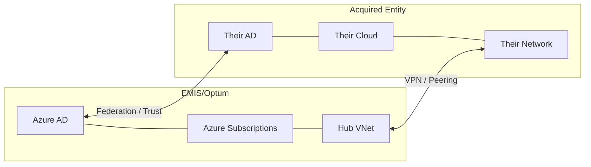
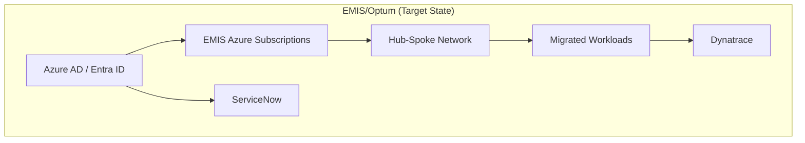
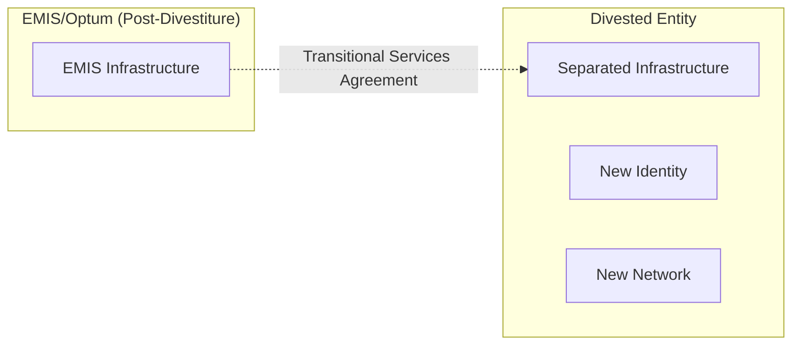

# M&A Integration Patterns

## Overview

EMIS/Optum, as part of UnitedHealth Group/Optum, participates in mergers, acquisitions, and divestitures. Infrastructure architects must be prepared to rapidly assess and integrate acquired entity infrastructure, or separate and divest business unit infrastructure.

## Integration Playbook

### Phase 1: Due Diligence & Assessment (Weeks 1-4)

**Goal**: Understand the acquired entity's infrastructure landscape.

| Activity | Output |
|----------|--------|
| Infrastructure inventory | Server, network, storage, cloud resource list |
| Application portfolio | Application inventory with hosting, dependencies, data classification |
| Network topology | Network diagrams, IP ranges, connectivity, firewall rules |
| Security posture | Compliance certifications, vulnerability status, security tooling |
| Cloud accounts | AWS accounts, Azure subscriptions, GCP projects |
| Identity & access | Directory services, SSO, MFA status |
| ITSM & operations | Ticketing system, monitoring, runbooks, on-call |
| Cost baseline | Current infrastructure spend (cloud + on-prem) |
| Technical debt | Known issues, unsupported platforms, end-of-life components |
| Data sovereignty | Where data resides; regulatory constraints |

### Phase 2: Integration Planning (Weeks 4-8)

**Goal**: Define the integration architecture and timeline.

**Key Decisions**:

| Decision | Options | Considerations |
|----------|---------|---------------|
| Identity integration | Merge into EMIS/Optum Azure AD / Forest trust / Federation | User experience, security, speed |
| Network integration | VPN/peering → ExpressRoute → Full network merge | Latency, bandwidth, security, cost |
| Cloud consolidation | Migrate to EMIS/Optum subscriptions / Separate but governed | Control, cost visibility, compliance |
| Application integration | Shared services / Standalone / Re-platform | Dependency complexity, timeline |
| Monitoring | Extend Dynatrace / Interim: keep existing + bridge | Visibility, cost, operational consistency |
| ITSM | Migrate to ServiceNow / Interim: integration layer | Process alignment, training |

**Integration Architecture Patterns**:

### Pattern 1: Coexistence (Quick, Low Risk)

**Use When**: Rapid integration required; acquired entity operates independently; low dependency on shared services.

### Pattern 2: Absorption (Full Integration)

**Use When**: Long-term integration; acquired entity to be fully absorbed; shared services operating model.

### Pattern 3: Separation (Divestiture)

**Use When**: Business unit being sold or spun off; requires clean separation of infrastructure, data, and access.

### Phase 3: Execution (Weeks 8-26+)

**Integration Workstreams**:

| Workstream | Activities | Owner |
|-----------|-----------|-------|
| **Identity** | AD trust/federation → AD Connect → Azure AD merge | Identity team |
| **Network** | VPN → ExpressRoute → VNet peering → Hub integration | Network team |
| **Security** | Baseline assessment → Policy alignment → Tooling deployment | Security team |
| **Compute** | Assessment → Migration planning → Wave execution | Infrastructure Architecture |
| **Data** | Classification → Migration → Validation → Decommission source | Data team + Architecture |
| **Monitoring** | Dynatrace agent deployment → Dashboard creation → Alert configuration | CloudOps |
| **ITSM** | Process alignment → ServiceNow migration → CMDB reconciliation | PIMS |
| **Cost** | Baseline → Tagging → Chargeback alignment | Finance + Architecture |

### Phase 4: Optimisation (Ongoing)

- Right-size migrated workloads based on actual utilisation
- Consolidate duplicate services and platforms
- Standardise on EMIS/Optum technology stack
- Decommission legacy acquired-entity infrastructure
- Update all documentation and CMDB

## M&A Checklist for Infrastructure Architects

### During Due Diligence
- [ ] Infrastructure inventory received and reviewed
- [ ] Network topology documented (including IP range conflicts)
- [ ] Security posture assessed (certifications, vulnerabilities, compliance gaps)
- [ ] Cloud account access arranged for assessment
- [ ] Cost baseline established
- [ ] Technical debt and risk register created
- [ ] Data sovereignty constraints identified

### During Integration Planning
- [ ] Integration pattern selected and approved by ARB
- [ ] Network integration plan created (IP range deconfliction, routing)
- [ ] Identity integration approach defined
- [ ] Migration wave plan produced
- [ ] Cost estimate for integration produced
- [ ] Transition Service Agreement (TSA) scope defined (if applicable)
- [ ] Risk register updated with integration-specific risks

### During Execution
- [ ] Landing zone provisioned for acquired workloads
- [ ] Network connectivity established and tested
- [ ] Identity federation/trust operational
- [ ] Monitoring deployed on acquired infrastructure
- [ ] First wave migrated and validated
- [ ] CMDB updated with integrated assets
- [ ] Compliance baselines applied to integrated infrastructure
