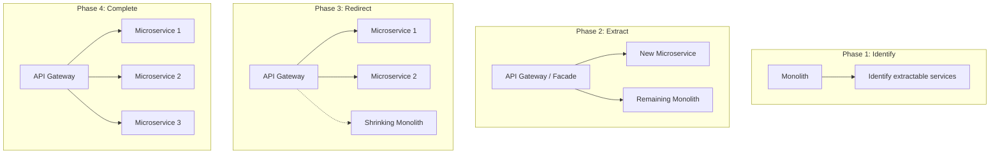

# Modernisation & Re-Platforming

## Overview

Modernisation is the strategic transformation of legacy applications and infrastructure to leverage cloud-native capabilities, improve agility, and reduce technical debt. Re-platforming sits between lift-and-shift and full refactoring.

## Modernisation Assessment Framework

### Application Disposition Model

Assess each application against these criteria to determine the modernisation approach:

| Criterion | Score 1 (Low) | Score 3 (Medium) | Score 5 (High) |
|-----------|--------------|-------------------|----------------|
| **Business Value** | Being retired; no active users | Stable; moderate user base | Strategic; high user base; revenue-generating |
| **Technical Debt** | Clean codebase; modern frameworks | Some legacy components; manageable debt | Significant debt; outdated frameworks; security risk |
| **Cloud Readiness** | Cloud-native; 12-factor | Some cloud-compatible components | Tightly coupled to on-prem; OS-dependent |
| **Complexity** | Simple; few dependencies | Moderate integration complexity | Highly complex; many dependencies |
| **Team Capability** | Experienced cloud-native team | Some cloud experience | Traditional ops; limited cloud skills |

### Disposition Matrix

| Business Value | Technical Debt | Recommended Approach |
|---------------|---------------|---------------------|
| High | High | **Refactor** — Strategic investment in modernisation |
| High | Low | **Re-Platform** — Quick wins to leverage cloud PaaS |
| Low | High | **Retire/Replace** — Not worth modernising |
| Low | Low | **Rehost** — Lift-and-shift; minimal investment |

## Re-Platforming Patterns

### Database Modernisation

| Source | Target | Tool | Considerations |
|--------|--------|------|---------------|
| SQL Server (on-prem) | Azure SQL Database | Azure DMS | Compatibility assessment; feature parity check |
| SQL Server (on-prem) | Azure SQL Managed Instance | Azure DMS | Near-100% compatibility; network-isolated |
| PostgreSQL (on-prem) | Azure Database for PostgreSQL Flexible Server | Azure DMS / pg_dump | Extension compatibility |
| MySQL (on-prem) | Azure Database for MySQL Flexible Server | Azure DMS | Engine version compatibility |
| Oracle | Azure SQL / PostgreSQL | Ora2Pg / SSMA | Schema conversion; stored procedure migration |

### Application Hosting Modernisation

| Source | Target | Approach |
|--------|--------|----------|
| IIS on Windows Server | Azure App Service | Azure App Service Migration Assistant |
| Apache/Nginx on Linux | Azure App Service (Linux) | Container-based migration |
| Monolith on VM | Containers on AKS | Strangler Fig pattern (incremental) |
| Batch processing on VMs | Azure Functions / Azure Batch | Event-driven redesign |
| File server | Azure Files / SharePoint | Azure File Sync (staged) |

### Strangler Fig Pattern

For incrementally modernising monolithic applications:



**Steps**:
1. Place an API gateway / reverse proxy in front of the monolith
2. Identify a bounded context that can be extracted (start with the simplest)
3. Build the new microservice using cloud-native patterns
4. Redirect traffic for that context to the new service
5. Repeat until the monolith is fully decomposed or only stable core remains

## Modernisation Decision Tree

```
Is the application being retired within 2 years?
├── Yes → RETIRE (decommission or replace with SaaS)
└── No
    ├── Is there a suitable SaaS replacement?
    │   ├── Yes → REPURCHASE (evaluate TCO including migration cost)
    │   └── No
    │       ├── Does the application have high business value?
    │       │   ├── Yes
    │       │   │   ├── Is the team capable of cloud-native development?
    │       │   │   │   ├── Yes → REFACTOR (cloud-native, containers, PaaS)
    │       │   │   │   └── No → RE-PLATFORM (managed services, minimal code change)
    │       │   │   └──
    │       │   └── No
    │       │       ├── Is there a compliance/security risk on current platform?
    │       │       │   ├── Yes → RE-PLATFORM (move to supported, compliant platform)
    │       │       │   └── No → REHOST (lift-and-shift to cloud VMs)
    │       │       └──
    │       └──
    └──
```

## Success Criteria

| Metric | Target |
|--------|--------|
| Migration completion | On schedule per wave plan |
| Post-migration incidents | ≤ baseline incident rate within 30 days |
| Performance | Within 10% of baseline or improved |
| Cost | Within 10% of estimate (or below) |
| Compliance | All compliance baselines met post-migration |
| User satisfaction | No degradation reported |
