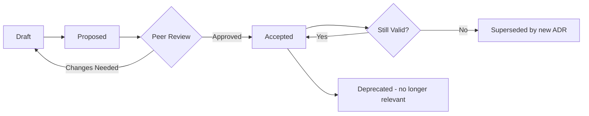

# Architecture Decision Record (ADR) Template

## Overview

An ADR is a short document that captures an important architecture decision, including the context, options considered, and rationale. ADRs are immutable once accepted — if a decision changes, create a new ADR that supersedes the previous one.

## Template

```markdown
# ADR-[XXXX]: [Title — Short Description of Decision]

## Status

**Proposed** | **Accepted** | **Deprecated** | **Superseded by ADR-[XXXX]**

## Date

YYYY-MM-DD

## Decision Makers

| Role | Name |
|------|------|
| Author | [Architect name] |
| Reviewer | [Peer reviewer] |
| Approver | [Senior architect / ARB] |

## Context

[Describe the situation and the problem that needs a decision. Include relevant background, constraints, and why this decision is being made now.]

- What is the business or technical driver?
- What constraints exist? (time, cost, compliance, technology)
- What has changed that makes this decision necessary?

## Decision

[State the decision clearly and unambiguously.]

**We will [do X].**

## Options Considered

### Option 1: [Name]

- **Description**: [What this option entails]
- **Pros**: [Advantages]
- **Cons**: [Disadvantages]
- **Cost**: [Indicative cost]
- **Risk**: [Key risks]

### Option 2: [Name]

- **Description**: [What this option entails]
- **Pros**: [Advantages]
- **Cons**: [Disadvantages]
- **Cost**: [Indicative cost]
- **Risk**: [Key risks]

### Option 3: [Name] (if applicable)

- **Description**: [What this option entails]
- **Pros**: [Advantages]
- **Cons**: [Disadvantages]
- **Cost**: [Indicative cost]
- **Risk**: [Key risks]

## Rationale

[Explain why the chosen option was selected over the alternatives. Reference specific criteria: cost, risk, alignment with standards, compliance, operational impact, strategic fit.]

## Consequences

### Positive
- [What improves as a result of this decision]

### Negative
- [What trade-offs or downsides come with this decision]

### Risks
- [What risks are accepted or introduced]

## Compliance

| Framework | Impact | Notes |
|-----------|--------|-------|
| HIPAA | None / Positive / Requires mitigation | [Details] |
| NIST | None / Positive / Requires mitigation | [Details] |
| CIS Level 2 | None / Positive / Requires mitigation | [Details] |
| ISO 27001 | None / Positive / Requires mitigation | [Details] |

## Related

- **Requirement**: [Link to requirement or demand]
- **HLD/LLD**: [Link to design document]
- **Supersedes**: [ADR-XXXX if replacing a previous decision]
- **Related ADRs**: [Links to related decisions]
```

## ADR Best Practices

1. **One decision per ADR** — Don't combine multiple decisions in one record
2. **Keep it concise** — ADRs should be 1-2 pages; detailed analysis can be linked
3. **Minimum 2 options** — Always consider at least 2 options (including "do nothing" where applicable)
4. **Record the context** — Future readers need to understand WHY the decision was made, not just WHAT
5. **Be honest about trade-offs** — Document both positive and negative consequences
6. **Immutable** — Don't edit accepted ADRs; create a new one that supersedes
7. **Number sequentially** — ADR-0001, ADR-0002, etc., within the project/domain
8. **Store centrally** — Confluence Architecture space or ADO Wiki; not in personal files1
9. **Review regularly** — Quarterly review of recent ADRs to ensure they're still valid

## ADR Lifecycle


