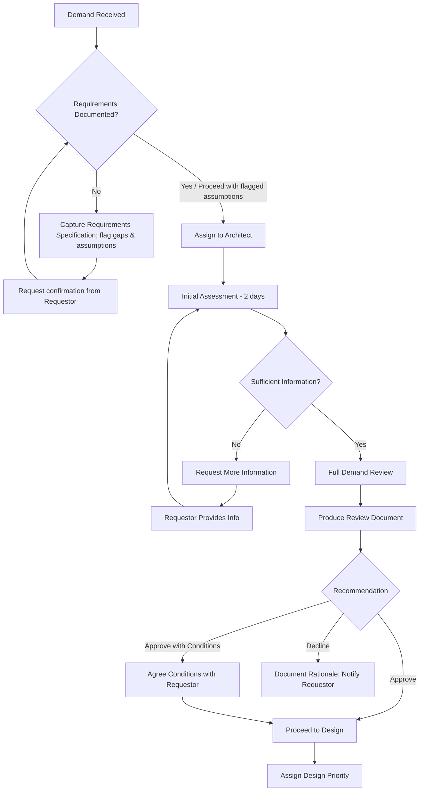

# Demand Review Checklist

## Overview

Every incoming demand (new infrastructure request, change to existing architecture, or project request) must be reviewed before design work begins. This checklist ensures consistent, rigorous assessment across all demands.

> **Prerequisite — Requirements Definition Gate (guardrails Section 7):** A documented set of requirements **MUST** exist before this review proceeds. Capture them in the [Requirements Specification Template](./requirements-specification-template.md) first. Where requirements are incomplete, capture what is known, flag the gaps and assumptions in Section 0 below, and request confirmation — do not review a demand on an undocumented brief.

## Demand Review Template

```markdown
# Demand Review — [Demand Title]

## Document Control

| Item | Detail |
|------|--------|
| Demand ID | [ServiceNow/ADO reference] |
| Requestor | [Name and team] |
| Review Date | YYYY-MM-DD |
| Reviewer | [Architect name] |
| Status | Under Review / Approved / Approved with Conditions / More Information Required / Declined |

## 0. Requirements Readiness Gate

> Confirm requirements are documented before proceeding. Reference the [Requirements Specification](./requirements-specification-template.md).

| Requirement Area | Status | Notes / Gaps |
|------------------|:------:|--------------|
| Functional requirements | ✅ Confirmed / ⚠️ Partial / ❌ Missing | |
| Non-functional requirements (availability, performance, scalability, DR — RTO/RPO) | ✅ / ⚠️ / ❌ | |
| Security & compliance requirements (HIPAA/NIST/CIS/ISO) + data classification | ✅ / ⚠️ / ❌ | |
| Constraints & assumptions | ✅ / ⚠️ / ❌ | |
| In-scope / out-of-scope | ✅ / ⚠️ / ❌ | |
| Success / acceptance criteria | ✅ / ⚠️ / ❌ | |
| Stakeholders, requestor & business driver | ✅ / ⚠️ / ❌ | |
| Cost / budget envelope & timeline | ✅ / ⚠️ / ❌ | |

**Requirements status:** ✅ Confirmed — proceed / ⚠️ Proceed against documented assumptions (gaps flagged) / ❌ Insufficient — request confirmation before continuing

**Requirements Specification reference:** [link / ID]

## 1. Demand Summary

| Item | Detail |
|------|--------|
| **What** | [What is being requested?] |
| **Why** | [Business justification / driver] |
| **Who** | [Consuming team / end users] |
| **When** | [Required by date] |
| **Where** | [Azure / AWS / On-prem / Hybrid] |

## 2. Feasibility Assessment

| Criterion | Assessment | Notes |
|-----------|-----------|-------|
| **Technical Feasibility** | ✅ Feasible / ⚠️ Feasible with constraints / ❌ Not feasible | [Explain] |
| **Technology Available** | ✅ Strategic stack / ⚠️ Tactical / ❌ Containment/new | [Which technologies?] |
| **Capacity Available** | ✅ Yes / ⚠️ Constrained / ❌ No | [Capacity details] |
| **Skills Available** | ✅ Yes / ⚠️ Training needed / ❌ No | [Skill gaps?] |
| **Timeline Realistic** | ✅ Yes / ⚠️ Tight / ❌ Unrealistic | [Explain] |

## 3. Strategic Alignment

| Priority | Alignment | Notes |
|----------|-----------|-------|
| Cloud-First Transformation | ✅ Aligned / ⚠️ Partial / ❌ Misaligned | |
| Cost Optimisation | ✅ Aligned / ⚠️ Partial / ❌ Misaligned | |
| Modernisation | ✅ Aligned / ⚠️ Partial / ❌ Misaligned | |
| Operational Excellence | ✅ Aligned / ⚠️ Partial / ❌ Misaligned | |
| Security & Compliance | ✅ Aligned / ⚠️ Partial / ❌ Misaligned | |

## 4. Risk Assessment

| Risk Category | Risk Level | Description | Mitigation |
|--------------|-----------|-------------|------------|
| **Technical** | H / M / L | [Technical risks] | [How to mitigate] |
| **Security** | H / M / L | [Security risks] | [How to mitigate] |
| **Compliance** | H / M / L | [Compliance risks] | [How to mitigate] |
| **Cost** | H / M / L | [Cost risks] | [How to mitigate] |
| **Operational** | H / M / L | [Operational risks] | [How to mitigate] |
| **Timeline** | H / M / L | [Schedule risks] | [How to mitigate] |
| **Dependency** | H / M / L | [Dependencies on other teams/projects] | [How to mitigate] |

## 5. Complexity Estimate

| Dimension | Estimate | Rationale |
|-----------|----------|-----------|
| **T-Shirt Size** | XS / S / M / L / XL | [Overall complexity justification] |
| **Estimated Effort** | X person-days | [Breakdown: design, build, test, handover] |
| **Estimated Cost** | £XX,XXX - £XX,XXX (ROM) | [Rough order of magnitude] |
| **Estimated Duration** | X weeks/months | [Including all phases] |

## 6. Dependencies

| Dependency | Team | Status | Impact if Not Met |
|-----------|------|--------|-------------------|
| [Dependency 1] | [Team] | Confirmed / Assumed / Unknown | [Impact] |
| [Dependency 2] | [Team] | Confirmed / Assumed / Unknown | [Impact] |

## 7. Non-Functional Requirements

| NFR | Requirement | Achievable? | Notes |
|-----|------------|-------------|-------|
| Availability | [e.g., 99.9%] | ✅ / ⚠️ / ❌ | |
| Performance | [e.g., < 200ms response] | ✅ / ⚠️ / ❌ | |
| Scalability | [e.g., 1000 concurrent users] | ✅ / ⚠️ / ❌ | |
| DR/BCP | [e.g., RTO 1hr, RPO 15min] | ✅ / ⚠️ / ❌ | |
| Data Classification | [Public / Internal / Confidential / Restricted] | ✅ / ⚠️ / ❌ | |
| Data Residency | [e.g., UK only] | ✅ / ⚠️ / ❌ | |

## 8. Recommendation

### Decision: **Approve / Approve with Conditions / Request More Information / Decline**

### Rationale
[Explain the recommendation with reference to the assessment above]

### Conditions (if applicable)
1. [Condition 1]
2. [Condition 2]

### Next Steps
1. [Action 1 — Owner — Due Date]
2. [Action 2 — Owner — Due Date]
3. [Action 3 — Owner — Due Date]

### Questions for Requestor (if requesting more info)
1. [Question 1]
2. [Question 2]
```

## Demand Review Process



## Complexity Sizing Guide

| Size | Characteristics | Typical Effort | Examples |
|------|----------------|---------------|---------|
| **XS (Extra Small)** | Config change only; no design artefacts required; no cross-team impact | < 2 person-days | Parameter change, tag update, minor config tweak |
| **S (Small)** | Single component; standard pattern; no new technologies; no cross-team dependencies | 2-10 person-days | VM resize, storage expansion, firewall rule, DNS change |
| **M (Medium)** | Multiple components; known pattern; standard technologies; limited dependencies | 10-30 person-days | New application deployment using approved patterns; database migration |
| **L (Large)** | Complex architecture; multiple teams; may involve new patterns; significant cost | 30-60 person-days | New platform deployment; multi-tier application; cross-environment solution |
| **XL (Extra Large)** | Enterprise-scale; new technology introduction; significant compliance impact; multi-month | 60+ person-days | Platform migration; M&A integration; new cloud landing zone; re-architecture |
