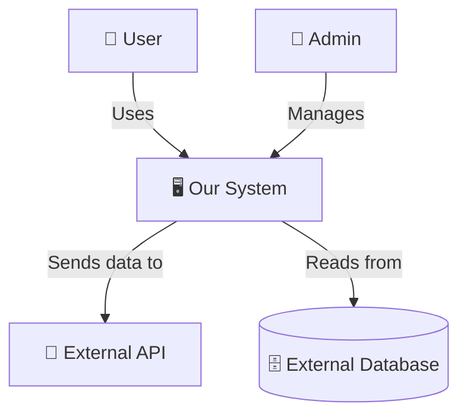
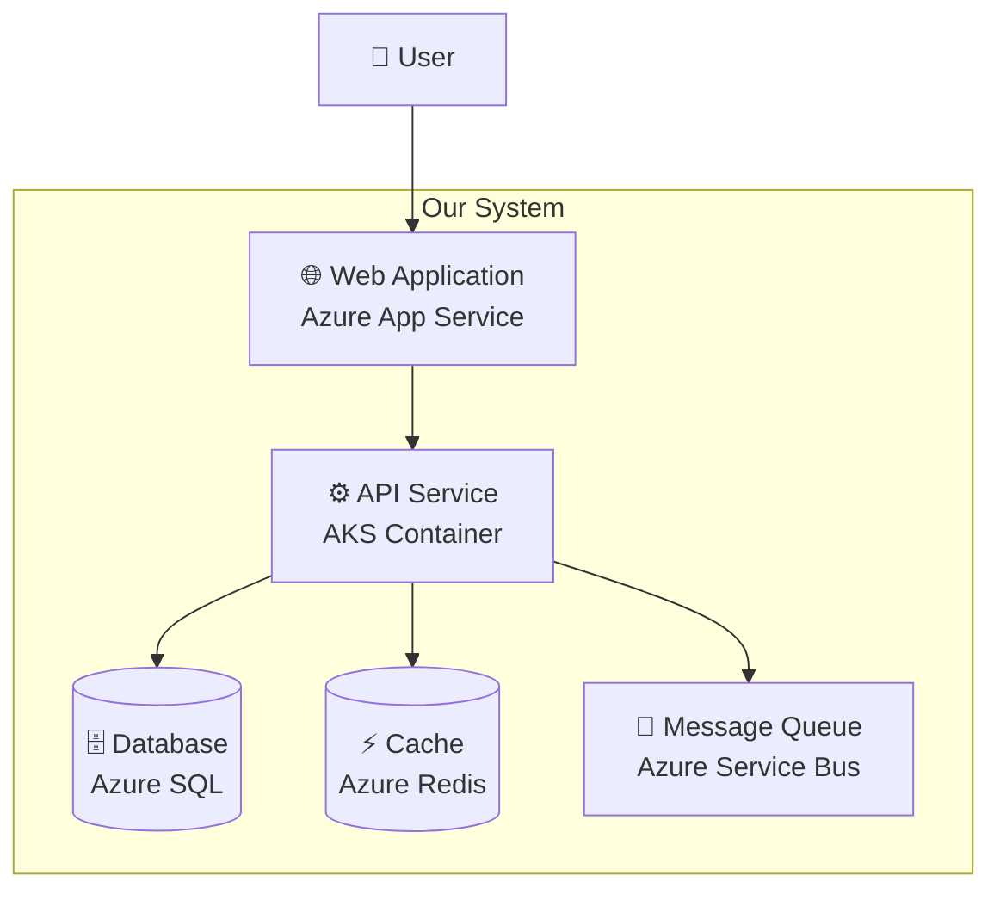
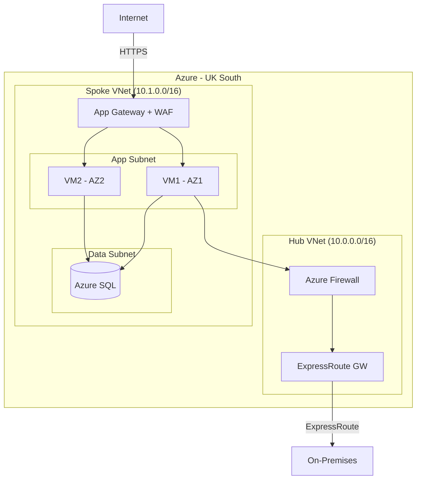
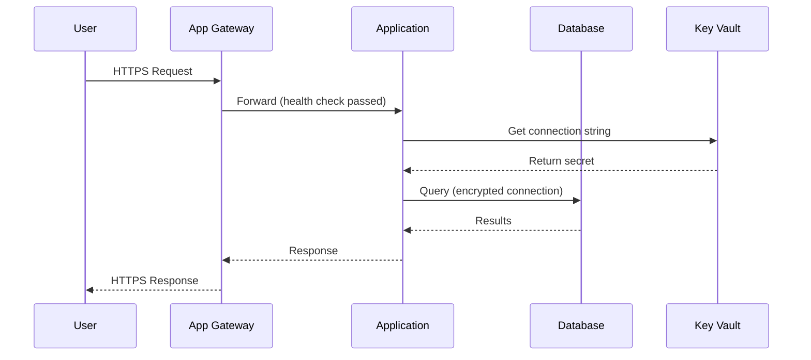
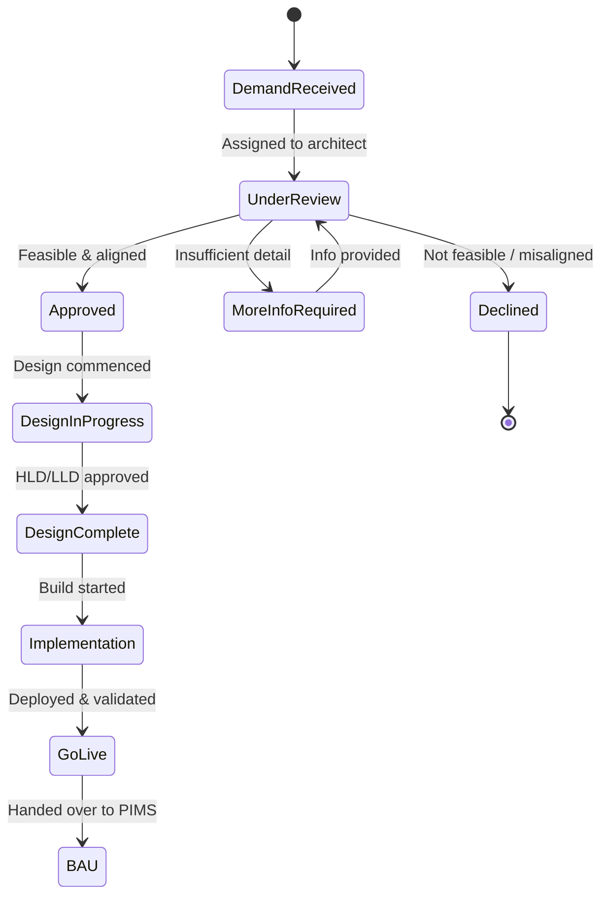
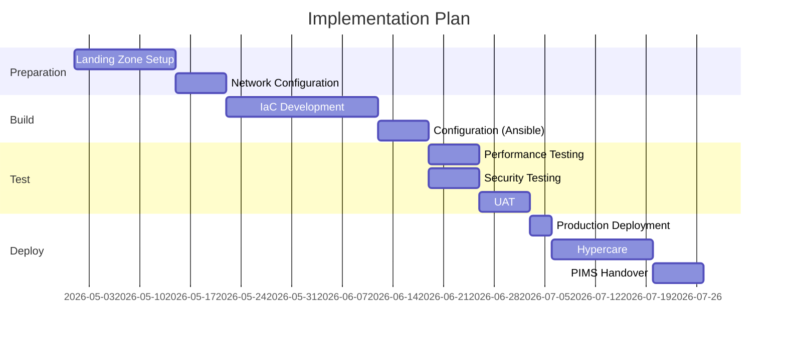

# Diagram Guidelines

## Overview

Architecture diagrams are essential deliverables in HLDs, LLDs, and presentations. This guide covers the approved tools, notation systems, and best practices for creating infrastructure diagrams at EMIS/Optum.

## Approved Diagramming Tools

| Tool | Use Case | Format | Collaboration |
|------|----------|--------|--------------|
| **Mermaid** | Inline diagrams in markdown, ADO Wiki, Confluence | Text-based (`.md`) | Version-controlled in Git |
| **draw.io (diagrams.net)** | Detailed network diagrams, architecture diagrams | `.drawio` / `.svg` / `.png` | VS Code extension; exportable |
| **C4 Model (with Structurizr or Mermaid)** | Layered architecture views | Text-based | Version-controlled |
| **Visio** (if required) | Legacy/formal documents | `.vsdx` | SharePoint |

> **Preferred**: Mermaid for documentation-embedded diagrams; draw.io for detailed designs. Both support version control.

## C4 Model

The C4 model provides four levels of abstraction. Use the appropriate level for the audience:

### Level 1: System Context

**Audience**: Business stakeholders, product owners
**Shows**: The system and its interactions with users and external systems



### Level 2: Container

**Audience**: Software architects, infrastructure architects
**Shows**: The high-level technology building blocks (applications, databases, message brokers)



### Level 3: Component

**Audience**: Application developers, technical architects
**Shows**: Internal components within a container (services, controllers, repositories)

### Level 4: Code

**Audience**: Developers
**Shows**: Class/module level detail — typically not produced by infrastructure architects

> **For infrastructure architecture**: Level 1 and Level 2 are almost always required. Level 3 is optional depending on complexity.

## Mermaid Diagram Types

### Flow/Architecture Diagram



### Sequence Diagram (for data flows / processes)



### State/Process Diagram



### Gantt Chart (for implementation timelines)



## draw.io Guidelines

### When to Use draw.io

- Detailed network topology diagrams (VNets, subnets, IP addresses, firewall rules)
- Physical data centre layouts
- Complex hybrid architecture diagrams
- Diagrams requiring custom icons (Azure/AWS service icons)
- Formal presentations and documents

### Standards

- **Canvas**: Use A3 landscape for detailed diagrams; A4 for simple diagrams
- **Icon Sets**: Use official Azure/AWS icon sets (available in draw.io libraries)
- **Colours**:
  - Blue: Azure services
  - Orange: AWS services
  - Grey: On-premises / VMware
  - Green: Security / compliant
  - Red: Risk / non-compliant / attention
  - Purple: Monitoring / observability
- **Labels**: All components must be labelled with name and key specification
- **Legend**: Include a legend for colours and line types
- **Version**: Include version and date in the diagram footer
- **Format**: Save as `.drawio` (editable) and export as `.svg` or `.png` for documents

### File Naming

```
[type]-[solution]-[scope]-v[version].drawio
Example: network-webapp-production-v1.2.drawio
Example: architecture-crm-overview-v1.0.drawio
```

## Diagram Checklist

Before including a diagram in a deliverable:

- [ ] Title and version included
- [ ] All components labelled with name and specification
- [ ] Network subnets include CIDR ranges
- [ ] Data flow direction indicated with arrows
- [ ] Legend included for colours and symbols
- [ ] Security boundaries (trust zones) clearly marked
- [ ] External dependencies shown
- [ ] DR components shown (if applicable)
- [ ] Readable at the document's target print/display size
- [ ] Consistent with the written design description
