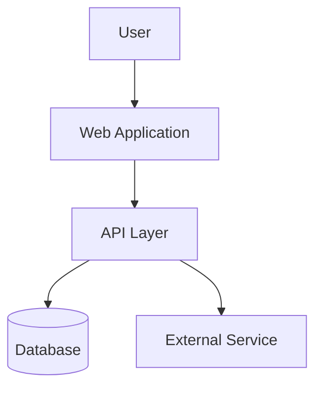
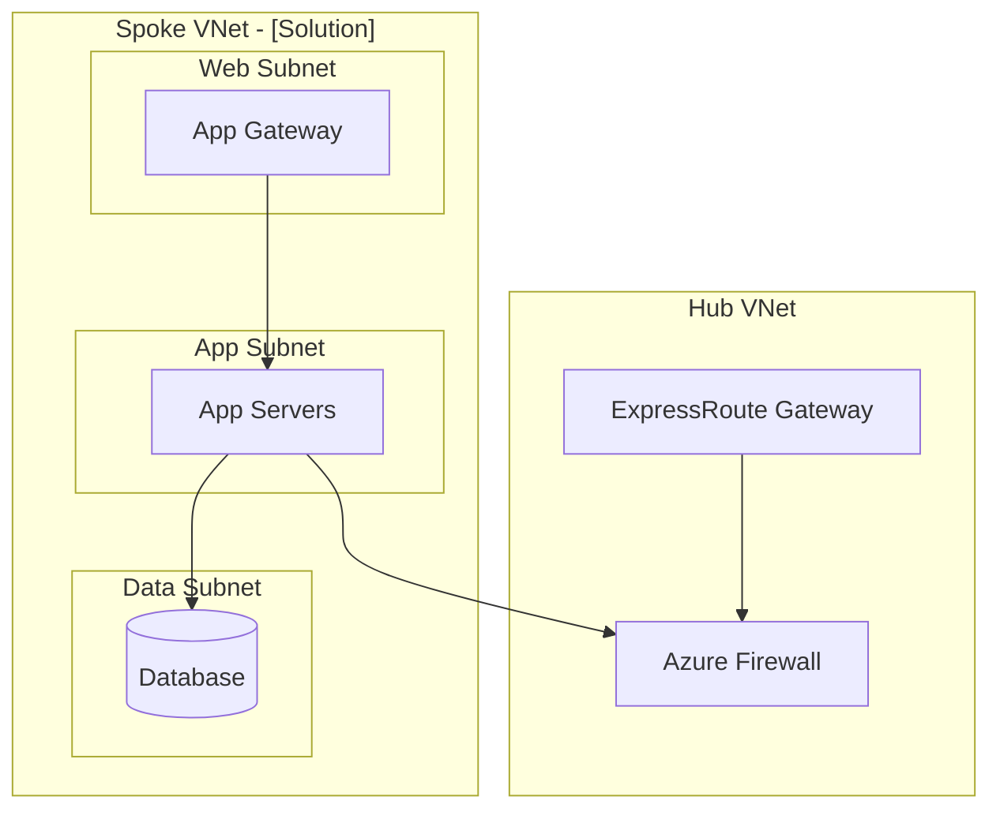

# High-Level Design (HLD) Template

## Template

```markdown
# High-Level Design — [Solution Name]

## Document Control

| Item | Detail |
|------|--------|
| Document ID | HLD-[XXXX] |
| Version | 1.0 |
| Author | [Architect name] |
| Date | YYYY-MM-DD |
| Status | Draft / In Review / Approved |
| Classification | Internal / Confidential |
| Reviewers | [Names and roles] |
| Approver | [Name and role] |

## Change History

| Version | Date | Author | Changes |
|---------|------|--------|---------|
| 0.1 | YYYY-MM-DD | [Name] | Initial draft |
| 1.0 | YYYY-MM-DD | [Name] | Approved version |

---

## 1. Executive Summary

[2-3 paragraphs summarising the solution, key design decisions, and expected outcomes. Written for a non-technical audience.]

## 2. Business Context

### 2.1 Business Requirements

| # | Requirement | Priority | Source |
|---|------------|----------|--------|
| BR-01 | [Requirement description] | Must / Should / Could | [Demand / stakeholder] |
| BR-02 | | | |

### 2.2 Business Drivers

- [Why is this solution needed? What business problem does it solve?]
- [Strategic alignment — reference business priorities]

### 2.3 Scope

| In Scope | Out of Scope |
|----------|-------------|
| [Component/capability] | [Component/capability] |

### 2.4 Stakeholders

| Stakeholder | Role | Interest |
|------------|------|---------|
| [Name/Team] | [Role] | [What they care about] |

## 3. Solution Overview

### 3.1 Architecture Overview

[High-level description of the solution architecture. Include the C4 Context diagram here.]



### 3.2 Key Design Decisions

| # | Decision | Rationale | ADR Reference |
|---|----------|-----------|---------------|
| 1 | [e.g., Azure over AWS] | [Why] | ADR-XXXX |
| 2 | [e.g., AKS over VMs] | [Why] | ADR-XXXX |

### 3.3 Assumptions

| # | Assumption | Impact if Invalid |
|---|-----------|-------------------|
| 1 | [Assumption] | [Impact] |

### 3.4 Constraints

| # | Constraint | Source |
|---|-----------|--------|
| 1 | [e.g., Data must reside in UK] | [HIPAA / Data Protection] |

## 4. Infrastructure Architecture

### 4.1 Compute

| Component | Platform | SKU / Spec | Qty | Environment | Notes |
|-----------|----------|-----------|-----|-------------|-------|
| [App Server] | Azure VM | Standard_D4s_v5 | 2 | Production | Zone-redundant |

### 4.2 Storage

| Component | Service | Type / Size | Redundancy | Encryption | Notes |
|-----------|---------|------------|------------|------------|-------|
| [App data] | Azure SQL | Business Critical 4vCore | Zone-redundant | TDE + TLS | Private endpoint |

### 4.3 Networking

[Include network topology diagram]



| Component | Type | Configuration |
|-----------|------|---------------|
| VNet | Azure VNet | [CIDR range] |
| Subnet — Web | Subnet | [CIDR] — NSG attached |
| Subnet — App | Subnet | [CIDR] — NSG attached |
| Subnet — Data | Subnet | [CIDR] — NSG attached |
| NSG Rules | Summary | [Key allow/deny rules] |

### 4.4 Security

| Control | Implementation |
|---------|---------------|
| Identity & Access | Azure AD RBAC with PIM; MFA enforced |
| Network Security | NSGs, Azure Firewall, private endpoints |
| Data Protection | AES-256 at rest, TLS 1.2+ in transit |
| Secrets Management | Azure Key Vault |
| Monitoring | Defender for Cloud; Dynatrace Security Analytics |
| Patching | Azure Update Manager; monthly cycle |

### 4.5 Monitoring & Observability

| Component | Tool | Configuration |
|-----------|------|---------------|
| APM | Dynatrace OneAgent | Auto-instrumented on all hosts |
| Infrastructure Metrics | Azure Monitor | CPU, memory, disk, network |
| Logging | Log Analytics | Application + platform logs; 90-day retention |
| Alerting | Dynatrace + Azure Monitor | P1-P4 alerting per standard |
| Dashboards | Dynatrace | [Dashboard names/links] |

### 4.6 Backup & Disaster Recovery

| Component | Backup Method | Frequency | Retention | RTO | RPO |
|-----------|-------------|-----------|-----------|-----|-----|
| VMs | Azure Backup | Daily | 30 days | Xh | Xh |
| Database | Azure SQL Backup | Continuous | LTR policy | Xh | Xmin |
| Files | Azure Backup | Daily | 30 days | Xh | Xh |

**DR Strategy**: [Active-Passive / Active-Active / Backup-Restore]
**DR Region**: [UK West]
**Failover Process**: [Automated / Manual — brief description]

## 5. Non-Functional Requirements Compliance

| NFR | Requirement | Design Compliance | Evidence |
|-----|------------|-------------------|----------|
| Availability | 99.9% | Zone-redundant compute + DB | Azure SLA composite |
| Performance | < 200ms API response | Premium compute + caching | Load test plan |
| Scalability | 1000 concurrent users | Auto-scaling + AKS HPA | Capacity analysis |
| Security | HIPAA, CIS Level 2 | See §4.4 | Compliance baseline check |
| DR | RTO 4h, RPO 15min | Geo-replica + Azure Backup | DR test plan |

## 6. Compliance Mapping

| Framework | Relevant Controls | Status |
|-----------|------------------|--------|
| HIPAA | [Key controls addressed] | ✅ Compliant |
| NIST CSF | [Key categories] | ✅ Compliant |
| CIS Level 2 | [Key benchmarks] | ✅ Compliant |
| ISO 27001 | [Key Annex A controls] | ✅ Compliant |

## 7. Cost Estimate

[Summary here; detailed BoM in appendix or linked document]

| Category | Monthly | Annual |
|----------|---------|--------|
| Compute | £XXX | £XXX |
| Storage | £XXX | £XXX |
| Networking | £XXX | £XXX |
| Monitoring | £XXX | £XXX |
| **Total** | **£XXX** | **£XXX** |

## 8. Implementation Plan

| Phase | Activities | Duration | Dependencies |
|-------|-----------|----------|-------------|
| 1 — Preparation | Landing zone, networking, IAM | X weeks | [Dependencies] |
| 2 — Build | IaC development, deployment | X weeks | Phase 1 |
| 3 — Test | Performance, security, UAT | X weeks | Phase 2 |
| 4 — Deploy | Production deployment, cutover | X weeks | Phase 3 + change approval |
| 5 — Hypercare | Intensive monitoring, issue resolution | 2 weeks | Phase 4 |
| 6 — Handover | PIMS handover, documentation | 1 week | Phase 5 |

## 9. Risks

| # | Risk | Likelihood | Impact | Mitigation | Owner |
|---|------|-----------|--------|------------|-------|
| 1 | [Risk] | H/M/L | H/M/L | [Mitigation] | [Who] |

## 10. References

| # | Source | Title | Location |
|---|--------|-------|----------|
| 1 | [Source] | [Title] | [URL/Link] |

## Appendices

- Appendix A: Detailed BoM
- Appendix B: Network diagram (full)
- Appendix C: ADR references
```

## HLD Mandatory Sections

Every HLD must include:

- [ ] Executive Summary
- [ ] Business Context (requirements, drivers, scope)
- [ ] Solution Overview with architecture diagram
- [ ] Infrastructure Architecture (compute, storage, networking, security, monitoring, DR)
- [ ] NFR Compliance matrix
- [ ] Compliance mapping (HIPAA, NIST, CIS, ISO)
- [ ] Cost Estimate (summary)
- [ ] Implementation Plan
- [ ] Risk Register
- [ ] References
