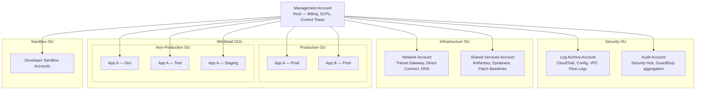
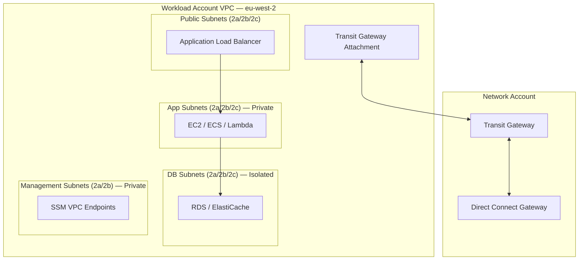

# AWS Landing Zone & Multi-Account Strategy

## Overview

EMIS/Optum's AWS estate uses a **multi-account architecture** managed via **AWS Organizations** with **AWS Control Tower** providing automated guardrails, compliance baselines, and account vending. Isolation at the account level is the primary security and blast-radius boundary.

> **Why multi-account?** Each AWS account has separate IAM namespaces, service limits, billing, and security boundaries. Account-level isolation is more robust than VPC-level isolation alone — a misconfiguration in one account cannot affect another.

---

## AWS Organizations Structure



### Account Types

| Account | Purpose | Sensitive Access |
|---------|---------|-----------------|
| **Management (Root)** | Billing, Organizations, Control Tower, SCPs only — no workloads | Strictly limited; break-glass only |
| **Log Archive** | Centralised immutable audit logs (CloudTrail, Config, VPC Flow Logs, S3 access logs) | Read-only for Security; no modification |
| **Audit** | Security Hub aggregation, GuardDuty master, Config aggregator, compliance dashboards | Read-only access for auditors |
| **Network** | Transit Gateway hub, Direct Connect gateway, centralised Route 53 Resolver rules | Network team only |
| **Shared Services** | Common tools: Artifactory, Dynatrace collectors, patch baselines, golden AMIs, EC2 Image Builder | Infra Engineering team |
| **Workload Production** | Live customer-facing services; each app team gets dedicated account(s) | Restricted; changes via IaC pipeline |
| **Workload Non-Prod** | Development, Test, Staging environments per application | Broader dev team access |
| **Sandbox** | Experimental / rapid prototyping; time-limited; no production data; auto-remediation rules relaxed | Individual developer access |

---

## AWS Control Tower

Control Tower automates the setup and governance of the landing zone.

### Guardrails

Control Tower guardrails are either **preventive** (enforced via SCP) or **detective** (enforced via AWS Config rules).

| Category | Example Guardrails | Type |
|----------|-------------------|------|
| **Mandatory** | Disallow changes to CloudTrail in enrolled accounts | Preventive (SCP) |
| **Mandatory** | Disallow deletion of Log Archive's S3 buckets | Preventive (SCP) |
| **Strongly Recommended** | Enable encryption for EBS volumes attached to EC2 | Detective (Config) |
| **Strongly Recommended** | Disallow public read access to S3 buckets | Detective (Config) |
| **Elective — EMIS custom** | Deny all regions except eu-west-2 and eu-west-1 | Preventive (SCP) |
| **Elective — EMIS custom** | Deny creation of IAM users (use IAM Identity Center SSO) | Preventive (SCP) |
| **Elective — EMIS custom** | Require IMDSv2 on all EC2 instances | Detective (Config) + Preventive |

### Account Vending

New AWS accounts are provisioned from the Control Tower **Account Factory**:

1. Request submitted via ServiceNow (with cost centre, owner, purpose, workload tier)
2. Account Factory creates account in the correct OU
3. Control Tower applies mandatory guardrails automatically
4. Baseline IaC (account bootstrap Terraform) runs via ADO pipeline:
   - VPC & subnet creation
   - Transit Gateway attachment
   - Security Hub, GuardDuty, Config enabled
   - IAM Identity Center permission sets assigned
   - Dynatrace OneAgent deployment via Systems Manager
   - CrowdStrike Falcon deployed via Systems Manager
   - Required S3 buckets (Terraform state, logging) created with encryption
   - Mandatory tags applied at account metadata level

---

## Service Control Policies (SCPs)

SCPs are the top-level guardrails applied at the OU or account level. They **can only deny** — they never grant permissions.

### Core SCPs Applied at Root Level

| SCP | Effect |
|-----|--------|
| `deny-non-approved-regions` | Denies all API calls outside `eu-west-2` and `eu-west-1`. Exceptions: global services (IAM, Route 53, CloudFront) |
| `protect-log-archive` | Denies deletion or modification of CloudTrail trails, Config recorders, and Log Archive S3 buckets |
| `deny-root-account-usage` | Denies all API calls made by the root user (except emergency break-glass procedure) |
| `require-encryption` | Denies creation of unencrypted S3 buckets, EBS volumes, RDS instances, and SQS queues |
| `deny-public-s3` | Denies S3 bucket or object ACLs that would make data public |
| `deny-internet-gateway-in-non-approved-vpcs` | Denies creation of internet gateways in workload accounts without explicit approval |

### OU-Specific SCPs

| OU | Additional SCP |
|----|---------------|
| **Production OU** | Deny IAM user creation; deny console password changes without MFA; deny manual resource provisioning outside IaC pipelines (IAM condition: `aws:RequestedRegion` + `iam:PrincipalTag/AutomationSource = true`) |
| **Sandbox OU** | Deny access to production data; limit instance sizes (max m5.xlarge / 4 vCPUs); auto-cleanup tag required |
| **Security OU** | Deny all non-Security team access; deny deletion of any resource |

---

## IAM Identity Center (AWS SSO)

All human access to AWS accounts is via **IAM Identity Center** (formerly AWS SSO), federated from **Azure AD / Entra ID**.

### Permission Sets

| Permission Set | Equivalent Azure RBAC | Accounts Granted |
|---------------|----------------------|-----------------|
| `AdministratorAccess` | Owner | Break-glass only; all accounts |
| `PlatformEngineer` | Contributor | Network, Shared Services, all non-prod |
| `ReadOnlyAccess` | Reader | All accounts |
| `HolisticViewer` | Reader + SecurityAudit | All accounts — Infra Architects |
| `SecurityEngineer` | Security Admin | Security OU accounts, all read |
| `DeveloperAccess` | Contributor (limited) | Workload non-prod accounts only |
| `NetworkEngineer` | Network Contributor | Network account |
| `BillingViewer` | Cost Management Reader | Management account |

**HolisticViewer permission set** (for Infrastructure Architects):
- `ViewOnlyAccess` + `SecurityAudit` + `AWSResourceExplorerReadOnlyAccess` + inline Cost Explorer reads
- Optional permissions boundary: enforces no writes / no sensitive reads

### Access Request Process

1. Raise ServiceNow request with justification and approval from manager
2. SecOps provisions permission set in IAM Identity Center
3. Access auto-assigned to the user's SSO group
4. Access reviewed quarterly; unused access auto-removed

---

## Network Architecture per Account

Each workload account has a standardised VPC structure:



**Subnet sizing guidelines**:

| Subnet | CIDR | Hosts | Notes |
|--------|------|-------|-------|
| Public (per AZ) | /27 | 27 | ALB only; no EC2 instances |
| App (per AZ) | /24 | 251 | Application tier |
| DB (per AZ) | /25 | 123 | Database tier; no internet route |
| Management (per AZ) | /27 | 27 | VPC endpoints, management tooling |
| TGW attachment (per AZ) | /28 | 11 | AWS reserved |

---

## Terraform Cross-Account Pattern

Workload IaC uses `assume_role` to deploy into target accounts from the ADO pipeline service identity:

```hcl
# Provider configuration for cross-account deployment
provider "aws" {
  region = "eu-west-2"

  assume_role {
    role_arn     = "arn:aws:iam::${var.account_id}:role/TerraformDeployRole"
    session_name = "TerraformDeploy-${var.environment}"
    external_id  = var.external_id
  }

  default_tags {
    tags = {
      CostCentre  = var.cost_centre
      Environment = var.environment
      Owner       = var.owner
      Application = var.application
      ManagedBy   = "Terraform"
    }
  }
}

# Terraform state stored in Shared Services account S3
terraform {
  backend "s3" {
    bucket         = "emis-terraform-state-shared"
    key            = "${var.application}/${var.environment}/terraform.tfstate"
    region         = "eu-west-2"
    dynamodb_table = "emis-terraform-state-lock"
    encrypt        = true
    role_arn       = "arn:aws:iam::<shared-services-account-id>:role/TerraformStateRole"
  }
}
```

**TerraformDeployRole** trust policy: trusted by the ADO pipeline service account (OIDC or IAM role) from the Shared Services account.

---

## Account Naming Convention

```
emis-<workload>-<environment>
```

| Example | Description |
|---------|-------------|
| `emis-emisweb-prod` | EMISWeb production workload account |
| `emis-emisweb-dev` | EMISWeb development account |
| `emis-network-shared` | Network hub account |
| `emis-security-log-archive` | Log Archive security account |
| `emis-security-audit` | Audit/Security Hub account |
| `emis-sandbox-johndoe` | Developer sandbox (auto-deleted after 90 days) |

---

## Security Baseline per Account (Automated by Bootstrap)

All accounts receive the following on creation:

| Service | Configuration |
|---------|---------------|
| **CloudTrail** | Multi-region trail; log file integrity enabled; logs to Log Archive S3 (cross-account) |
| **AWS Config** | All resource types recorded; delivery to Log Archive; conformance pack: CIS AWS v3.0 |
| **GuardDuty** | Enabled; member account delegated to Audit account aggregator |
| **Security Hub** | Enabled; member account delegated to Audit account aggregator; CIS AWS v3 + HIPAA standard enabled |
| **IAM Access Analyzer** | Enabled for organisation-level analysis |
| **VPC Flow Logs** | Enabled on all VPCs; sent to CloudWatch Log Group |
| **S3 Block Public Access** | Enabled at account level |
| **EBS Default Encryption** | Enabled (AWS KMS, account-level key) |
| **IMDSv2** | Required for all new instances (enforced via SCP + Config rule) |
| **Budget Alert** | Alert at 80% and 100% of account budget; notification to team lead |

---

## References

- [AWS Control Tower documentation](https://docs.aws.amazon.com/controltower/latest/userguide/what-is-control-tower.html)
- [AWS Organizations best practices](https://docs.aws.amazon.com/organizations/latest/userguide/orgs_best-practices.html)
- [AWS IAM Identity Center](https://docs.aws.amazon.com/singlesignon/latest/userguide/what-is.html)
- [AWS Prescriptive Guidance — Landing Zone](https://docs.aws.amazon.com/prescriptive-guidance/latest/aws-multi-account-security-strategy/welcome.html)
- [AWS Standards](./aws-standards.md) — Service-level standards per AWS technology domain
